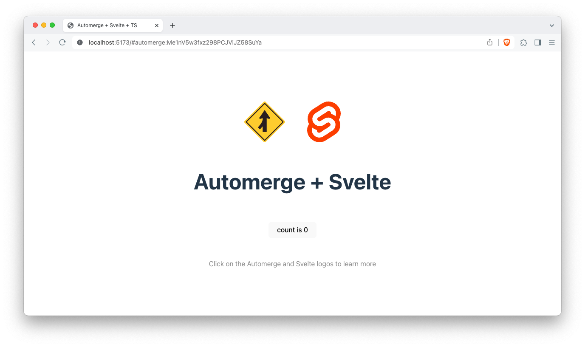

# Automerge Svelte Counter Demo



This example is an implementation of the [vite demo app](https://vite.new/svelte-ts) using Automerge Repo as a base, with the first party [svelte store](../../packages/automerge-repo-svelte-store).

## Quickstart

Start by cloning Automerge Repo to your local device:

```bash
git clone git@github.com:automerge/automerge-repo.git
```

```bash
cd automerge-repo
```

> [!IMPORTANT]
> All the commands listed here need to be run **in the root directory of the monorepo** and **using pnpm** as the package manager.
> The automerge-repo monorepo uses features which are specific to [pnpm](https://pnpm.io/installation).

From the **root directory**, install dependencies and build the monorepo using `pnpm`:

```bash
pnpm install
```

```bash
pnpm build
```

Finally, again from the root directory, run the vite dev server to get the demo app running:

```bash
pnpm dev:svelte-demo
```

You can now visit the site on your favourite browser at `http://localhost:5173/`.

## Next Steps

With the demo app running in your browser, copy the URL (which will now include a #hash) and open another window/tab.
You will see that updating the counter in one tab updates any other tabs.

Refreshing the page will reload the document from local storage, using [IndexedDB](../../packages/automerge-repo-storage-indexeddb). Syncing between tabs/windows is being performed over [BroadcastChannel](../../packages/automerge-repo-network-broadcastchannel) by Automerge repo.

**NB. If you open a new window without the #hash in the url, this will create a new Automerge document, with a new counter.**

## Sync Server

Keeping your demo vite server running, start a local automerge repo [sync server](../sync-server) with:

```bash
pnpm start:syncserver
```

If you now load the demo app in either a different browser, or an incognito mode window in your current browser, _with the same URL and hash_, you will see that the automerge document holding the counter will now be synced via the server between different browsers. If you observe the server process running in your terminal, you will see that each time you click the counter button, messages are being exchanged between the browser and the server, keeping the document in sync in all places.
